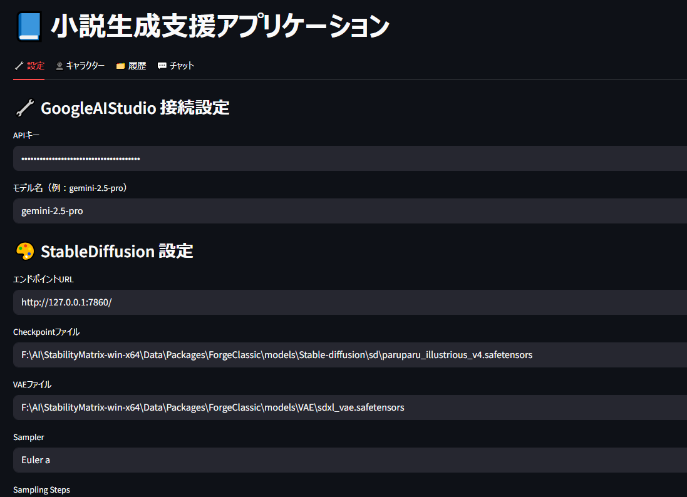

# ✨ Geminisd StoryMaker

**Geminisd StoryMaker**は、GoogleのGemini API（AI Studio）とローカルのStable Diffusionを連携させ、インタラクティブに小説生成と挿絵生成を行えるストーリー制作支援ツールです。  
GUIには [Streamlit](https://streamlit.io/) を使用し、直感的な操作が可能です。

## 🎯 目的

- **Gemini API**を使ってプロンプトベースの小説生成を行い
- **Stable Diffusion**で対応する挿絵を自動生成
- プロンプト履歴、キャラクター情報、画像ログなどを整理して保存

同人作家・ビジュアルノベル開発者・創作支援AIツール愛好家に最適です。

---

## 🗂️ 機能概要

- 過去ログの保存・再読込・続き生成（セッション管理）
- キャラクター設定の一元管理（JSON形式）
- 挿絵プロンプト自動抽出・生成・保存
- Chat内容に自動でSD用プロンプト命令を追加
- GUIによる簡易操作（Streamlit）
- ローカルSDとの連携（Web API）

---

### 🖥️ インストール方法（推奨）

#### 1. リポジトリをクローン

```bash
git clone https://github.com/yourname/geminisd_storymaker.git
cd geminisd_storymaker
```

#### 2. 必要なライブラリをインストール

```bash
pip install -r requirements.txt
```

> ⚠️ `Python 3.10` 以上を推奨します。

---

### ✅ `requirements.txt` に含めるべきライブラリ例

```txt
streamlit
requests
watchdog
Pillow
xmltodict
```

もし `google.generativeai` を将来使う場合はそれも加えられますが、現在の構成では REST API を直接叩いているため、現時点では不要です。

---

必要なら `requirements.txt` のファイルもこちらで作成してお渡しできます。何か追加したいライブラリがあれば教えてください。


---

## 🚀 実行方法

```bash
streamlit run app.py
```

初回起動時、`config/config.xml` を自動生成します。

---

## 🎨 Stable Diffusion の起動方法（必須）

このアプリはWebUIのAPIモードでローカルSDと連携します。以下の起動オプションが必要です：

```bash
webui-user.bat --api --listen --no-gradio-queue --cors-allow-origins *
```

またはLinux/コマンドラインで起動する場合：

```bash
python launch.py --api --listen --no-gradio-queue --cors-allow-origins '*'
```

StabilityMatrixで起動している場合、LaunchOptionを開き、Extra Launch Argumentsに
```
--no-gradio-queue --listen --api --cors-allow-origins *
```
---

## 🔑 Google AI Studio APIキーの取得方法

1. [https://makersuite.google.com/app](https://makersuite.google.com/app) にアクセス
2. 上部「Get API Key」ボタンをクリック
3. APIキーを取得し、`config/config.xml` の `<api_key>` に設定

---

## ⚙️ 設定方法

### ステップ1：アプリを起動し「設定」タブを開く

アプリを実行すると、画面上部に「設定」「キャラクター」「履歴」「チャット」などのタブが表示されます。
この中から **「設定」タブ** を選択してください。

以下のような設定項目が画面に表示されます：



### ステップ2：各種設定を入力

* **GoogleAIStudio 接続設定**

  * `APIキー`：Google AI Studio から取得した APIキー
  * `モデル名`：gemini-2.5-pro など

* **StableDiffusion 設定**

  * エンドポイントURL（例：`http://127.0.0.1:7860/`）
  * 使用するモデルやVAEファイルのパス
  * Sampler、Step数、画像サイズなど

* **画像プロンプト補足命令**
  小説の最後に自動的に追加するプロンプト説明文を設定できます。
 config.xmlの`<image_instruction>` に指定された文は、毎回のプロンプト末尾に自動で挿入されます。
 画像を出したくない場合はトークン節約のために削っても構いません
　初期値
```
  <image_instructions>
    挿絵として使いたいので、小説を出力した最後に以下のプロンプトを出力してください。
    [Prompt:]の中に、ヒロインの服装（tied_shirt,denim_shortsなど）や状況などをStableDiffusion用のプロンプトを英語で出力してください
    （画質や身体などの情報は既に含まれているので服装やポーズ、表情、背景や状況などで大丈夫です）
    もう一人の人物がいる場合は1boyあるいは1guyあるいは1old_man,monsterなどの形で相応しいキャラの分を追加してください。
    出力例：[Prompt:school_uniform,skirt,1boy]という形で[]内に収まるようにしてください
  </image_instructions>
```

### ステップ3：「💾 設定を保存」ボタンを押す

設定変更後は、**必ず画面下部の「💾 設定を保存」ボタン**を押してください。
これにより、設定内容が `config/config.xml` に保存され、次回以降も自動で反映されます。


---

## 📝 キャラクター設定（characters/ 以下）

キャラは以下のようなJSON形式で保存します：

```json
{
  "レミリア": {
    "名前": "レミリア",
    "年齢": "不明",
    "性別": "女性",
    "SD用プロンプト": "1girl, white_hair, red_eyes,",
    "SD Negative Prompt": "blurry, lowres"
  }
}
```

`characters` フォルダに複数のキャラファイルを追加可能です。

---

## 📁 保存場所

* 小説・プロンプト履歴：`outputs/logs/`
* 挿絵画像：`outputs/images/`

--

## 👤 キャラクターの登録方法

### 🔹 キャラクターとは？

本アプリでは、\*\*登場人物の外見情報（StableDiffusion用プロンプト）\*\*を事前に登録しておくことで、小説の挿絵としてキャラクター画像を自動生成することができます。
また、必要に応じて**軽い性格設定や背景情報**を登録しておくと、チャットでの物語生成にも一貫性が出て便利です。

---

### 🔸 登録手順

1. **「キャラクター」タブ**をクリックします。
2. 必要な情報を入力してください：

| 項目      | 内容                                                       |
| ------- | -------------------------------------------------------- |
| 名前      | キャラクターの名前（小説・挿絵の両方で参照されます）                               |
| 年齢・性別   | 任意。ただし絵柄や雰囲気の参考になるため、入力推奨です                              |
| 体型・髪型   | StableDiffusionのプロンプトに反映されるため、簡潔な英語で記述します                |
| 髪色・瞳の色  | 例：blonde hair, green eyesなど                              |
| 容姿プロンプト | StableDiffusion用。tied\_shirt, ponytail, gothic\_lolitaなど |

---

### 🖼️ 容姿プロンプトの書き方（例）

* `long_hair, blue_eyes, ponytail, school_uniform, thighhighs`
* `silver_hair, gothic_lolita, red_eyes, bat_wings, demon_girl`
* `short_hair, athletic_body, tracksuit, confident_expression`

> 💡 容姿に加えて**服装やポーズ・表情・状況**などは、チャットでの指示に応じて自動で付与されるため、登録時に細かく記述する必要はありません。

---

### ✅ キャラクターを活用するには？

* チャットの中でキャラ名を使うと、自動でプロンプトにその容姿が反映されます。
* 画像生成時に、キャラ名ごとに背景や服装などを動的に差し替えて使えます。
* 保存されたキャラ情報はJSONファイルとして管理され、編集や再利用が容易です。

---


## 💬 チャットでの小説生成方法

### 🔹 基本の使い方

* **チャットタブ**を開くと、小説生成のための入力欄があります。
* 新規に物語を始める場合は、そのまま「小説のテーマや登場人物など」を自由に入力してください。
* **過去の続きを書きたい**場合は、「履歴を選択」から任意のログファイルを選び、過去の会話と画像を確認してから続きを入力できます。

---

### 📝 チャット入力サンプル

以下のような指示を入力すると、物語の冒頭を生成してくれます。

```
桃原リリカという変な学校の後輩について、平凡な男の子である主人公視点でのラノベ形式の小説を出力してください。
学校でも白衣を着て天才ぶっているけど、別に成績が良いということでもなく。
ジト目で見上げてきて妙に「先輩」と呼んでかまってくる
自信家なのに陰キャで自分以外に話しかけてこられない不思議な陰キャ少女
```

このように、**キャラクター性・関係性・舞台設定・文体の希望**を簡潔に書くことで、意図に沿った小説が生成されやすくなります。

---

### 🧩 注意点

* 本アプリは、入力したテキストの最後に「挿絵として使うためのプロンプト」を自動付与するようになっています（設定により変更可能）。
* GoogleAIのAPIトークンの制限に注意してください。長すぎる入力・出力はエラーになる場合があります。

---

### 🔁 過去チャットを続ける場合

「📖 過去チャットを続ける」セクションでは、以下の手順で過去の続きを生成できます。

1. **履歴を選択**：保存されたログファイル（Markdown形式）を選びます。
2. **前回までの内容と画像が表示される**ので、流れを確認します。
3. **「続きの入力」欄に続きを書く**か、プロンプトを入力して「📨 続きを送信」をクリック。
4. 自動で画像が生成され、チャットログに保存されます。

---

## ❓よくある質問（FAQ）

**Q. APIキーの料金はかかりますか？**
→ AI Studioでの使用量に応じて従量課金されます（初期は無料枠あり）

**Q. Stable Diffusion WebUIはどこで入手できますか？**
→ Stability Matrixからの導入が推奨です：[Stability Matrix](https://github.com/LykosAI/StabilityMatrix)

**Q. エラーが出たときは？**
→ Streamlit画面のエラーメッセージを参照してください。

---

## 🧠 今後の予定

* プロンプト保存テンプレート機能
* マルチキャラクター画像合成対応
* キャラ辞書のタグ展開補助
* HuggingFace経由のクラウド利用対応

---

## 💡 ライセンス

MITライセンス（予定）

---

## ✨ Special Thanks

* Google AI Studio
* Stable Diffusion WebUI
* Streamlit Community
* ChatGPT4o
